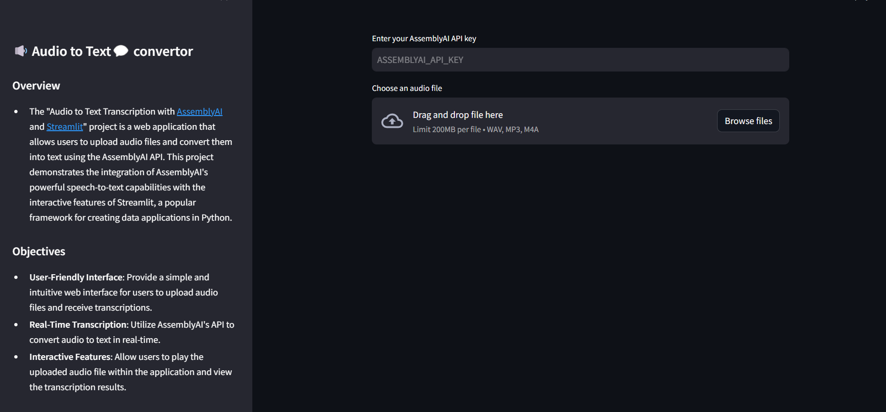

# Audio to Text Transcription with [AssemblyAI](https://www.assemblyai.com/) and [Streamlit](https://streamlit.io/)

The "Audio to Text Transcription with [AssemblyAI](https://www.assemblyai.com/) and [Streamlit](https://streamlit.io/)" project is a web application that allows users to upload audio files and convert them into text using the AssemblyAI API. This project demonstrates the integration of AssemblyAI's powerful speech-to-text capabilities with the interactive features of Streamlit, a popular framework for creating data applications in Python.

## Objectives

- **User-Friendly Interface**: Provide a simple and intuitive web interface for users to upload audio files and receive transcriptions.
- **Real-Time Transcription**: Utilize AssemblyAI's API to convert audio to text in real-time.
- **Interactive Features**: Allow users to play the uploaded audio file within the application and view the transcription results.

## Key Features

- **Audio File Upload**: Users can upload audio files in various formats including WAV, MP3, and M4A.
- **API Integration**: Seamless integration with AssemblyAI API for uploading audio files and fetching transcription results.
- **Real-Time Feedback**: Display a progress spinner while the transcription is being processed and show the transcription result once completed.
- **Audio Playback**: Allow users to play the uploaded audio file directly in the application.
- **Error Handling**: Provide appropriate feedback in case of transcription failures.

## Implementation Steps

### Step 1: Clone the repository
    $ git clone https://github.com/Bhavik-Jikadara/Audio-To-Text.git
    $ cd Audio-To-Text/

### Step 2: Create a virtualenv (windows user)
    $ pip install virtualenv
    $ virtualenv venv
    $ source venv/Scripts/activate

### Step 3: Install the requirements libraries using pip
    $ pip install -r requirements.txt

### Step 4: Type this command and run the project:
    $ streamlit run streamlit_app.py

## Follow:
* Linkedin Link: https://www.linkedin.com/in/bhavikjikadara
* Github Link: https://github.com/Bhavik-Jikadara
* Facebook Link: https://www.facebook.com/Bhavikjikadara07
* Instagram Link: https://www.instagram.com/bhavikjikadara/
* twitter Link: https://twitter.com/BhavikJikadara1

##  Subscribe
* https://www.youtube.com/channel/UC7Bp_sYQmAryrrPqvUp6PwQ

##  Donate & Support us
* https://www.paypal.com/paypalme/bhavikjikadara
